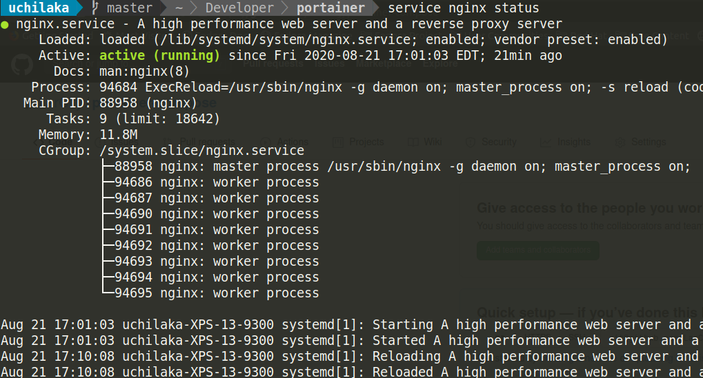

# portainer.local

> These instructions are for running portainer on an Ubuntu Linux environment ONLY. That said, if you are versed in using docker, feel free to translate as needed for WSL2 or other environments. Happy modding 🍻

Running apps on a local docker engine is a great way to sandbox them for exploration. You can discreetly designate ports, have them "up" on startup along with your local docker engine... fun stuff. Lets get started

## Step 1: Install Docker Engine

You should already be versed with docker. If not... um, you skipped a step. Check out [Install Docker on Ubuntu](https://docs.docker.com/engine/install/ubuntu/) to get your local environment setup.

## Step 2: Clone this repository

Once you've `cd` into your cloned repo, run the following command to start (daemonized) your portainer instance

## Step 3: Up and running! 

Run the following command to get your local instance of portainer going:

```bash
# Run in the root of your cloned repository
docker-compose up -d
```

> The following steps are optional, if you want to get fancy and run your local GUI for managing docker @ http://portainer.local (for example)

## Step 4: Install Nginx

You might have this running already (if you already do web stuff on your environment). To check:

```bash
sudo service nginx status
```

This should output something like this if nginx is up and running:



## Step 5: Setup your domain in `/etc/hosts`

Edit your `/etc/hosts` file to add the following lines:

```bash
127.0.0.1   portainer.local # or whatever domain you would like
::1         portainer.local
```

This will ensure that your browser routes requests for that domain to your local server. 

## Step 6: Setup your reverse proxy for ☝🏾 

You will need a reverse proxy configured to map your requests to the `portainer` service running @ `127.0.0.1:9000`. Follow these steps:

### Step 6a: Create your reverse proxy site

```bash
# Save as /etc/nginx/sites-available/portainer
upstream portainer-app {
        server 127.0.0.1:9000;
}

server {
        server_name portainer.local;

        location / {
                proxy_pass              http://portainer-app;
                proxy_redirect          off;
                proxy_set_header        Host $host;
                proxy_set_header        X-Real-IP $remote_addr;
                proxy_set_header        X-Forwarded-Host $server_name;
        }

        listen 80;
        listen [::]:80;
}

```

### Step 6b: symlink your new site

Run the following steps:

```bash
# symlink the new site
sudo ln -s /etc/nginx/sites-available/portainer /etc/nginx/sites-enabled/
```

### Step 6c: Reload `nginx`

Run `sudo service nginx reload`. You should now be able to browse to your local `portainer` instance at http://portainer.local 🎊

